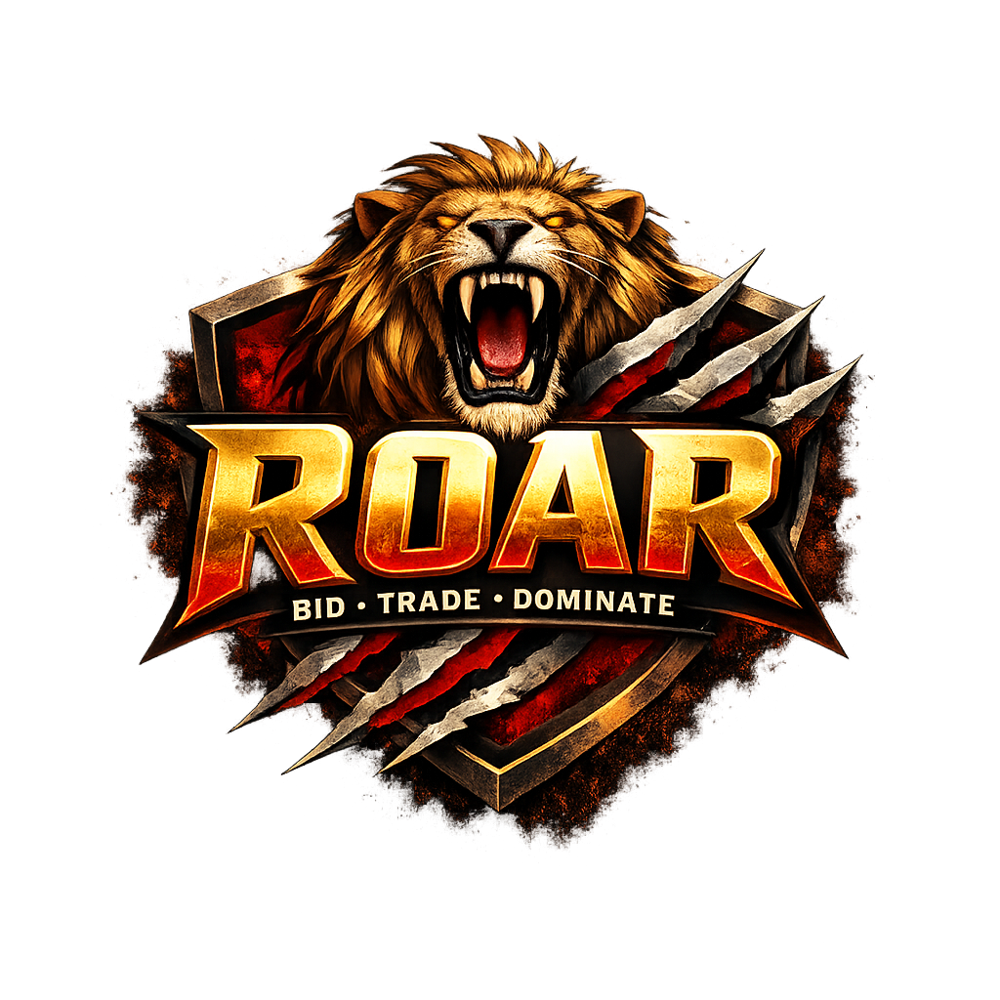

# ROAR — Multiplayer Card Game Engine

  

  <strong>BID • TRADE • DOMINATE</strong>

  A real-time, competitive full-stack multiplayer card game built with an authoritative server architecture, zero database persistence, and rapid state synchronization interfaces.

  

---

##  Current Project Status: Under Implementation
>  **Note:** This engine is currently in an active development phase (**Stage 3 Stable**). Core mechanics like the turn state machine, table layouts, and initial public auction settlement are completely operational. Advanced secondary trade functions are actively being implemented.

---

##  Interface & Aesthetic 
* **The War Table Perspective:** A dark, high-fidelity jungle aesthetic featuring a centralized, fixed-perspective 3D elliptical playing board.
* **Tactile Visual Layout:** Opponents sit in a radial pattern along the upper rim of the circular table with dynamic visual indicators, while your private hand fanning layout stays neatly grouped at the bottom edge of the screen.
* **Streamlined Economy Styling:** High-contrast, premium currency cards displaying absolute monetary values ($10, $20, $50) with clean typography—completely decoupled from animal illustrations to avoid mechanical asset confusion.

---

##  Engine Features & Core Architecture

**ROAR** utilizes a decoupled web topology designed for seamless, fast-paced match sessions:

* **Authoritative In-Memory Server:** Built with Node.js & Socket.io to prevent client-side data tampering. Game loops, decks, and transactions live entirely in server RAM.
* **Turn State Machine (`CHOOSE_ACTION` & `AUCTION` Phases):**
  * **Free Draw Advantage:** Turn starts with a zero-cost card pull that immediately populates the active player's inventory without a baseline bank transaction fee.
  * **Strategic Branching:** Draws instantly render face-up for all table participants and trigger a decision gateway forcing the drawer to choose between **"Keep Card"** (conclude turn for free) or **"Trade Card"** (kick off a public auction).
* **Restricted Increment Auction Loop:** Dynamic incremental bidding driven strictly via a `BID +$10` mechanism. Text inputs are forbidden. The engine enforces an automated financial ceiling check that instantly forces a player to `PASSED` if a bid exceeds their current combined cash total.
* **Change-Making Financial Settlement:** A server-side transaction compiler (`settleAuctionPayment`) that processes exact $10, $20, and $50 bill combinations. It calculates payouts, deducts winning balances, processes change, and directly routes cash earnings back into the seller's literal financial array upon auction completion.
* **Strict Privacy Middleware:** Advanced server-side scrubbing filters structural data packets dynamically, ensuring opponents can only see financial metrics as primitive card counts while preserving hidden inventory values.

---

##  Core Gameplay Loop Flow

graph TD

    A[Phase: DRAW] -->|draw-card event| B(Free Draw: Card to Drawer Inventory)
    B --> C[Phase: CHOOSE_ACTION]
    C -->|chooseAction: keep-card| D[Keep Card: Turn Advances]
    C -->|chooseAction: initiate-trade| E[Phase: AUCTION]
    E -->|place-bid / pass-bid| F{Auction Resolves?}
    F -->|No| E
    F -->|Yes| G[Financial Settlement: Winner Pays Seller]
    G --> H[Advance Turn & Reset to DRAW]

## Repository Structure

roar-game/
├── backend/
│   ├── server.js              # Express + Socket.io event loop orchestration & settlement logic
│   └── package.json           # Server environments & dependencies
└── frontend/
    ├── src/
    │   ├── components/        # Game UI views (Lobby, GameBoard, Auction Panels)
    │   ├── App.jsx            # Core state manager and WebSocket connection router
    │   └── main.jsx           # Client application entrypoint
    ├── vite.config.js         # Tooling and dev-proxy network layout
    └── package.json           # React dependencies
